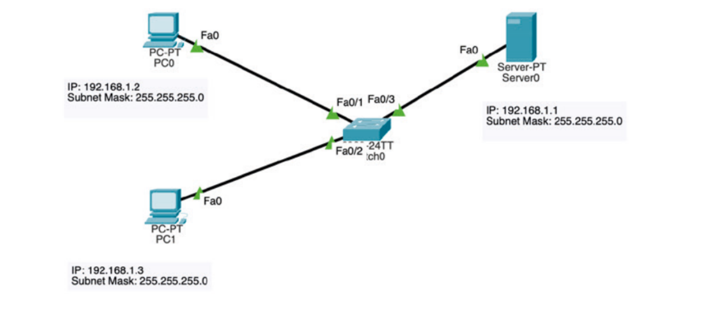
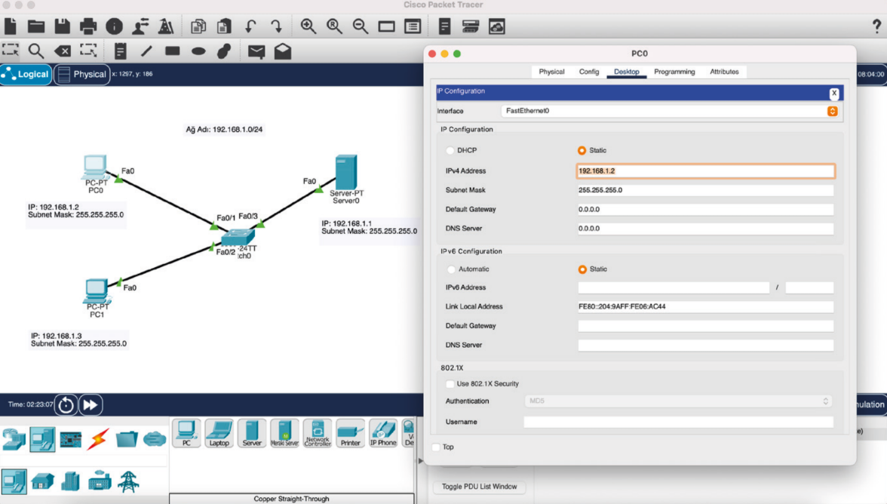

Prepare the LAN topology shown in the image in the simulation program according to the steps.
- Create the network topology shown in the image. The IP addresses and subnet masks of the PC0, PC1, and Server0 devices are given in the image.

Enter the IP address and subnet mask information for the devices using the user interface.
- By accessing the GUI interface, verify the communication between devices PC0, PC1, and Server0 in turn using the
"ping" command.

