Wireless Network Simulation : First, we add 3 computers and a switch.

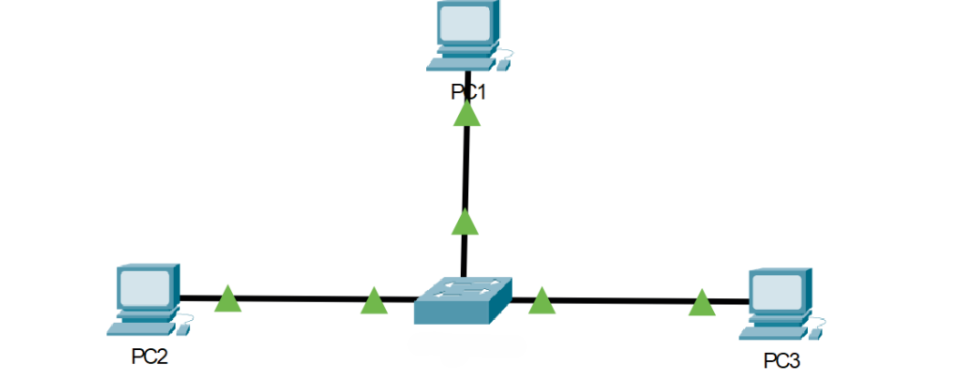

We connect the devices and add a laptop.

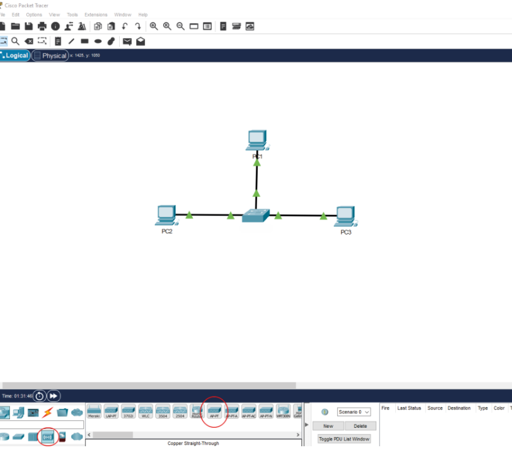
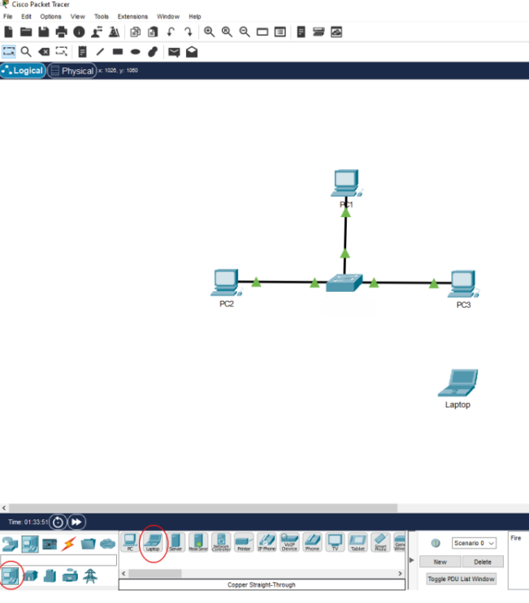

We add the device named AP-PT to our topology and connect it via port 0 to any port on the switch.

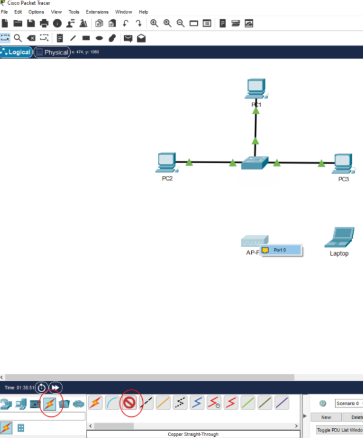
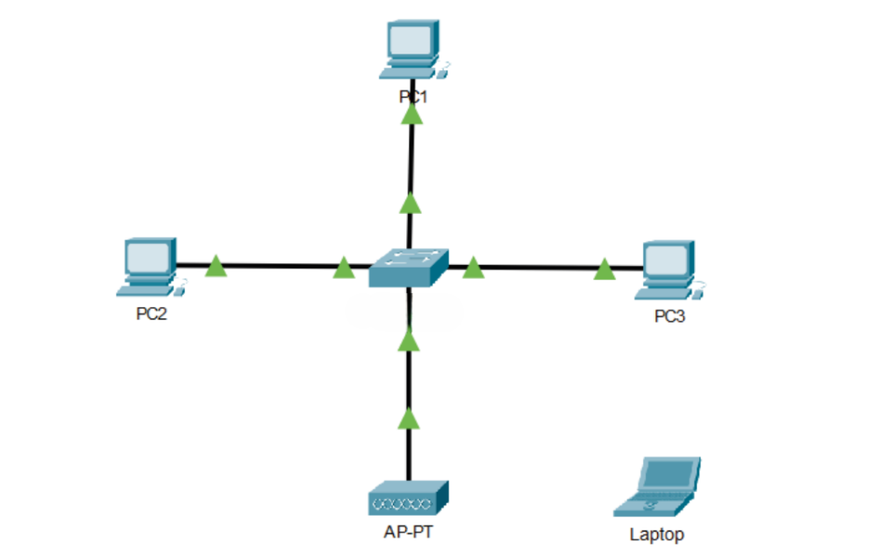

Left-click on the laptop you added to the topology and select the WPC300N device from the window that opens.
Then, turn off the laptop from area #1.
Drag the device from area #2 to area #3.
Turn on your laptop by clicking on area number 1.

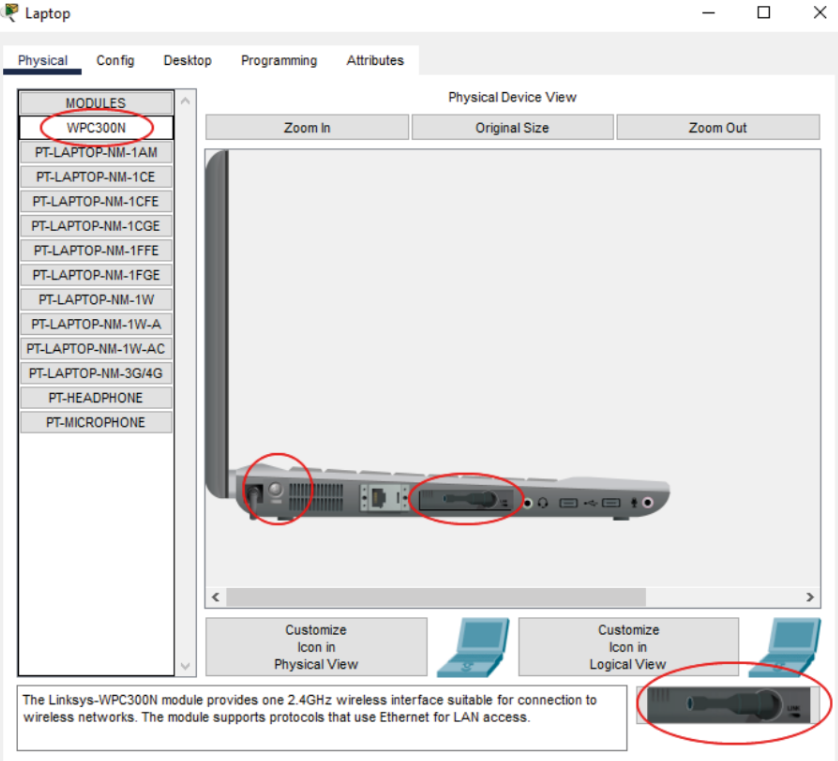

Click on the Access Point device named AP-PT, and in the window that opens (as shown in the image), go to the Config tab and click on the Port 1 field.

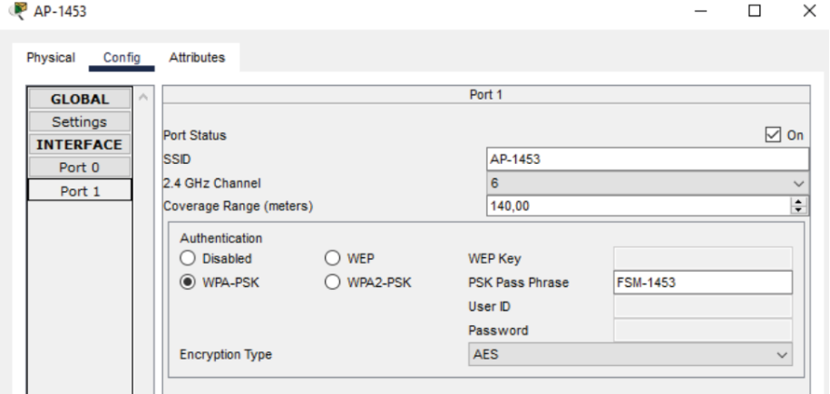

Enter AP-2026 in the SSID field. In the Authentication field, select WPA-PSK as the encryption type. Enter AP-20266 as the password.
(NOTE: Do not use the same SSID and password, and they don't have to be exactly as shown in the image; you can change them.)
(The AP device name can be changed from the global>settings section in the same window.)

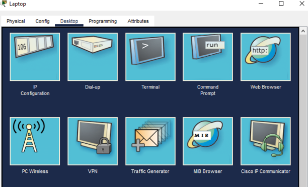

In the window that opens by clicking on the laptop, go to the Desktop tab at the top and run the PC Wireless application.

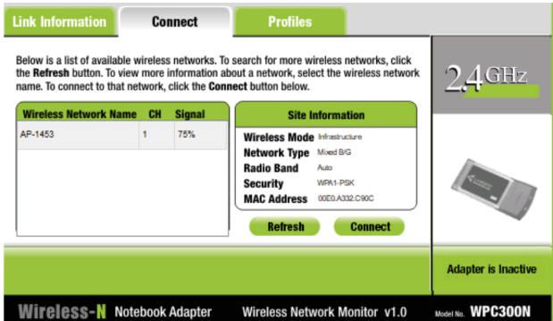

In the window that opens, go to the Connect tab and press the Refresh button. After a short wait, your laptop will find the AP-2026 wireless network. Then press the Connect button.

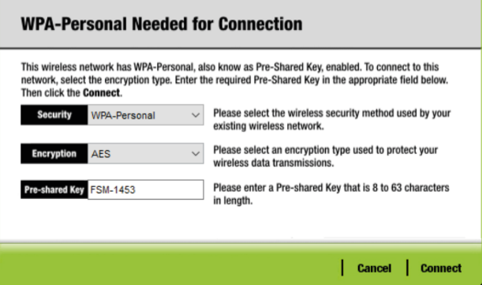

In the window shown in the image, enter the password you chose in the Pre-shared Key field and click the Connect button.

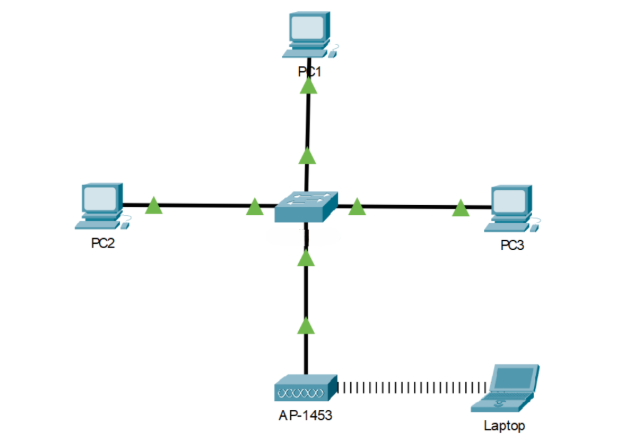

